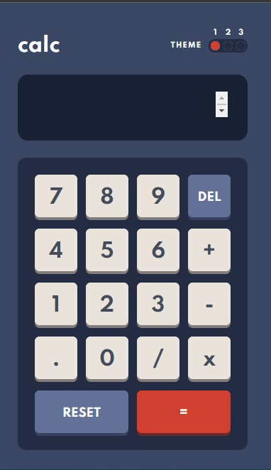

Modern react Calculator-3Theme

## Getting Started

First, run the development server:
```bash
npm run dev
# or
yarn dev

pen [http://localhost:3000](http://localhost:3000) 
with your browser to see the result.

Installation
git clone https://github.com/Jama-Hassan/Modern-React-Calculator
cd react-calculator
npm install

To run in development mode:-
npm start

To make a production build, edit the package.json file and change the following line to what is appropriate for your environment:-

"homepage": "http://jsxcode.com/reactapps/modernreactcalculator/“

"homepage": “.”

and then go ahead and run the build:-

npm run build

Creating Stylish  React Calculator With  Theme
using HTML, CSS and JavaScript
Introduction
In this trick, we are going to create a calculator. We need to create a basic structure using HTML, style it using CSS and make it work using JavaScript.

Create an Reactapp.
Here, I created the div (.box) which represent the structure of calculator. Inside it, I created two div tags, one for display (inside this, I added input type="text" to display the result and set this to read only) and one for Keys. Here,

Creating Stylish  React Calculator With  Theme

Create CSS Styleshee, CSS Keys, CSS display, and Finally, we have created Stylish  React Calculator With  Theme


### Screenshot




The challenge
Users should be able to:
* See the size of the elements adjust based on their device's screen size
* Perform mathematical operations like addition, subtraction, multiplication, and division
* Adjust the color theme based on their preference


Available Scripts

In the project directory, you can run:

npm start
Runs the app in the development mode.
Open http://localhost:3000 to view it in the browser.
The page will reload if you make edits.
You will also see any lint errors in the console.

npm test
Launches the test runner in the interactive watch mode.
See the section about running tests for more information.

npm run build
Builds the app for production to the build folder.
It correctly bundles React in production mode and optimizes the build for the best performance.
The build is minified and the filenames include the hashes.
Your app is ready to be deployed!
See the section about deployment for more information.

npm run eject
Note: this is a one-way operation. Once you eject, you can’t go back!
If you aren’t satisfied with the build tool and configuration choices, you can eject at any time. This command will remove the single build dependency from your project.
Instead, it will copy all the configuration files and the transitive dependencies (Webpack, Babel, ESLint, etc) right into your project so you have full control over them. All of the commands except eject will still work, but they will point to the copied scripts so you can tweak them. At this point you’re on your own.
You don’t have to ever use eject. The curated feature set is suitable for small and middle deployments, and you shouldn’t feel obligated to use this feature. However we understand that this tool wouldn’t be useful if you couldn’t customize it when you are ready for it.

Learn More
You can learn more in the Create React App documentation.
To learn React, check out the React documentation.

Code Splitting
This section has moved here: https://facebook.github.io/create-react-app/docs/code-splitting

Analyzing the Bundle Size
This section has moved here: https://facebook.github.io/create-react-app/docs/analyzing-the-bundle-size

Making a Progressive Web App
This section has moved here: https://facebook.github.io/create-react-app/docs/making-a-progressive-web-app

Advanced Configuration
This section has moved here: https://facebook.github.io/create-react-app/docs/advanced-configuration

Deployment
This section has moved here: https://facebook.github.io/create-react-app/docs/deployment

npm run build fails to minify
This section has moved here: https://facebook.github.io/create-react-app/docs/troubleshooting#npm-run-build-fails-to-minify

